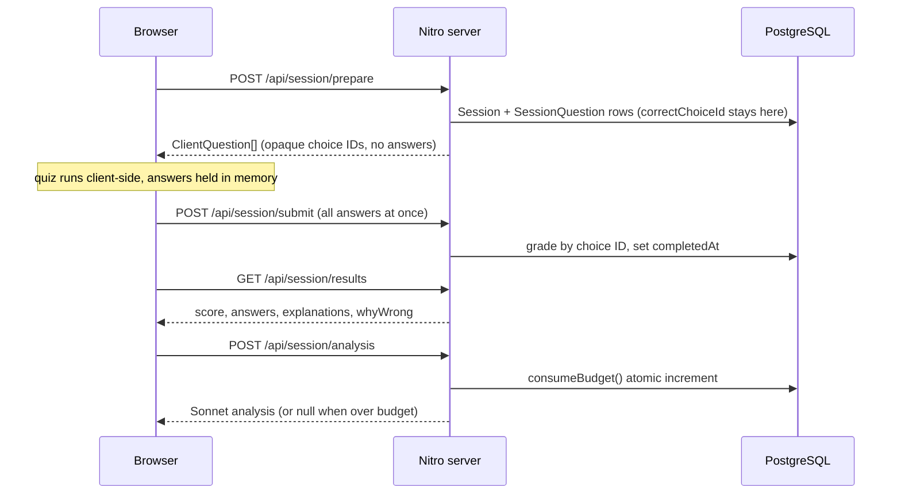

# Architecture

The technical brief: the five decisions that carry this codebase, each as choice, reasoning, trade-off accepted, and what happens to it in the Bayana port, with file paths so nothing asks to be taken on faith. The five: correct answers live only on the server during a quiz; generation is offline while the one live AI call is atomically budgeted; localStorage is a cache, never a source of truth; admin trust is a derived stateless token and question quality is a majority vote; the schema ships by `db push` on boot instead of migrations. [SPEC.md](SPEC.md) is the full spec and the source of truth; this is the shorter read.

Kalima is being merged into [Bayana](https://bayana.chairulakmal.com) ([TODO.md](TODO.md#status-superseded-2026-07-25)), whose successor app is greenfield **Nuxt**, so the port is Nuxt to Nuxt and most of what follows moves rather than gets rewritten. Each decision below closes with a **Ports as** line saying which. The full per-file brief for that port, including artifact shapes and the word crosswalk, is [SPEC §14](SPEC.md#14-port-surface).

## Correct answers live only on the server during a quiz

Questions are assembled in [server/utils/assembleQuestion.ts](server/utils/assembleQuestion.ts): the correct answer and three AI-generated distractors become four choices with freshly minted opaque UUIDs, shuffled by [shuffle.ts](server/utils/shuffle.ts). Before the response leaves [prepare.post.ts](server/api/session/prepare.post.ts), `toClientQuestion` projects each question down to `ClientQuestion` ([app/types/index.ts](app/types/index.ts)), dropping `isCorrect`, `correctAnswer`, and `explanation`. The winning choice ID lives in the `SessionQuestion` row ([prisma/schema.prisma](prisma/schema.prisma)); [submit.post.ts](server/api/session/submit.post.ts) grades by comparing IDs, and answers, explanations, and `whyWrong` notes are disclosed only by [results.get.ts](server/api/session/results.get.ts) after submit. Cheating is prevented by construction: there is nothing to find in the payload, the DOM, or localStorage. The rejected alternative, client-side assembly, is [SPEC §12.1](SPEC.md#12-alternatives-considered).

**Trade-off:** paid on the results page. Since the quiz payload carried no answer material, [results.get.ts](server/api/session/results.get.ts) has to reconstruct what the student saw: re-derive each prompt from the word data, refetch distractors by `(wordId, type)`, and match the wrong choice text back to its `whyWrong`. One extra round trip and some duplicated prompt logic, accepted to keep the quiz payload clean.

**Ports as:** moved, and moved first. `assembleQuestion.ts` imports only `shuffle.ts` and types, so it travels unchanged; the three session routes are Nitro to Nitro, with only their Prisma calls reshaped. This is the property the mock exam is built around, and Bayana's own checklist says to port it before anything else.

## Generation is offline; the one live call is budgeted atomically

The live app never generates questions. The pool is 496 rows, one per `(wordId, type)` (unique constraint in [schema.prisma](prisma/schema.prisma)), committed at [questions-n3.json](prisma/seed-data/questions-n3.json) and upserted idempotently by [seed.ts](prisma/seed.ts) on every deploy. The generator script is deliberately kept out of the repo; its prompt rules, per-type dispatch, and distractor validation are recorded in [SPEC §6.1](SPEC.md#61-seed-question-generation-offline-committed). Generating per session was rejected: it would put an anonymous endpoint in front of paid API calls ([SPEC §12.3](SPEC.md#12-alternatives-considered)).

That leaves one live Anthropic call, the analysis in [analysis.post.ts](server/api/session/analysis.post.ts), guarded twice. The hard ceiling is `consumeBudget()` in [rateLimit.ts](server/utils/rateLimit.ts): one Postgres upsert-plus-increment that reserves a slot atomically, closing the check-then-increment race the first version had (C2 in [SECURITY.md](SECURITY.md)). Under it, a per-IP fixed-window throttle ([throttle.ts](server/utils/throttle.ts), 10/hour) stops one client draining the shared budget. Results cache on `Session.analysis`, so revisiting costs nothing.

**Trade-off:** a fixed pool and a hard stop. Repeat players eventually see repeated questions, and once `DAILY_API_LIMIT` is spent the flagship AI feature disappears for everyone until midnight UTC, degrading to `{ analysis: null }` rather than erroring. Both are right for a public demo where the realistic threat is denial of wallet, not scale.

**Ports as:** `consumeBudget()` moves and is wanted urgently, since Bayana's limiter is in-memory and cannot bound spend across a restart. The per-IP throttle gets re-decided: fixed windows in process memory are correct here only because one replica serves everything. The pool itself is data, not code, and its exact shape is [SPEC §14.3](SPEC.md#143-artifacts-and-their-exact-shapes).

## localStorage is a cache, never a source of truth

Two keys, both disposable. `kalima_session_v1` ([useSession.ts](app/composables/useSession.ts)) mirrors the active session so a mid-quiz refresh restores from cache ([quiz.vue](app/pages/quiz.vue) falls back to it when the Pinia store is empty); the database stays authoritative and the mirror holds only the answer-free `ClientQuestion` shape. `kalima_review_v1` ([reviewQueue.ts](app/stores/reviewQueue.ts)) is the wrong-answer queue: upserted after every results page, pruned when a review session gets a word right, replayed through the existing [prepare](server/api/session/prepare.post.ts) endpoint, which whitelists every `type` and dedupes the pairs. No new endpoint, no accounts, no schema change.

SSR discipline makes it safe: every access sits behind `import.meta.client`, the review store loads only from `onMounted` via [useReviewQueue.ts](app/composables/useReviewQueue.ts), and both stores are Pinia options stores, not setup stores, so SSR serialization never traverses Vue ref internals ([SPEC §7](SPEC.md#7-client-cache)).

**Trade-off:** progress is device-local. The queue does not roam to another browser and dies with cleared site data. For an account-less demo that is the honest deal, and it is the first thing to move server-side once accounts exist.

**Ports as:** re-decided. Bayana has accounts, so the queue rehomes onto per-user rows and the whole SSR-discipline apparatus becomes unnecessary. The behaviour that has to survive is the pruning rule: a word answered correctly in a review session leaves the queue. Bayana's open question is whether the queue should feed its FSRS `ReviewState` rather than sit beside it.

## Admin trust is a derived token; question quality is a vote

`/admin` (audit and rate all 496 questions) is protected by one shared `ADMIN_PASSWORD`, but the password never travels in a cookie. [adminAuth.ts](server/utils/adminAuth.ts) derives a deterministic HMAC token from it, so verification is stateless, a leaked cookie cannot reveal the secret, and rotating the password invalidates every session at once. Comparisons go through constant-time `safeEqual()`, the model is fail-closed (unset password denies everything), login is brute-force throttled, and [admin-auth.ts](server/middleware/admin-auth.ts) guards every `/api/admin/*` route; the client guard in [admin.global.ts](app/middleware/admin.global.ts) is UX, not the boundary. [SECURITY.md](SECURITY.md) records what forced this: the original cookie held the raw password.

Quality control is structural. Each question carries S-F reviews and [rank.ts](server/utils/rank.ts) computes the effective rank by majority vote, ties breaking toward the worst rank. S, A, B, and unranked are protected from deletion, so bulk cleanup can never silently discard unreviewed or known-good content. There is one admin identity today; the vote logic is in place for when there are more.

**Trade-off:** stated openly in [SECURITY.md](SECURITY.md). One shared credential means no per-user attribution, rotation policy, or MFA, and throttle state is in-process memory. Fine for a single-maintainer demo on one instance; on the list to replace before real accounts ship.

**Ports as:** left behind, deliberately. Bayana gates admin on `UserProfile.role = ADMIN` and already has a sentence-audit page planned, so the rank review folds into that surface and the `ADMIN_PASSWORD` HMAC path does not travel at all. Note what that leaves stranded: the S-F ranks and reviewer notes in `ExamQuestionReview` exist only in the running database, with no committed copy anywhere in this repo.

## The schema ships by `db push` on boot, not migrations

There is no `prisma/migrations` directory. Production start ([package.json](package.json)) is `prisma db push --accept-data-loss`, then `prisma db seed`, then the server; [railway.json](railway.json) pins Railpack and one replica in `asia-southeast1`. Word data is not in the database at all: [words/n3.json](words/n3.json) and siblings are read via `fs` at request time by [prepare](server/api/session/prepare.post.ts), [results](server/api/session/results.get.ts), and [analysis](server/api/session/analysis.post.ts), so the dictionary ships with the code.

The reasoning: every table is either reproducible from the repo (the seed pool) or disposable (anonymous sessions, daily rate-limit rows), so migrations would version data nothing needs preserved, while `db push` keeps schema iteration at editing one file. The single-replica pin is not incidental: the in-memory throttle windows in [throttle.ts](server/utils/throttle.ts) are correct only because one process handles all traffic.

**Trade-off:** `--accept-data-loss` will happily drop a renamed column, at-boot re-seeding adds startup time that grows with the pool, and the moment real user data exists this pipeline needs proper migrations, with throttle state moved to a shared store if it ever scales past one instance. Documented cliffs, deliberately not paid for early.

**Ports as:** left behind entirely, and so is the schema it ships. Bayana is redesigning its data model against three sources at once and resets its production database at cutover, so nothing here is a migration source. What does travel is the reason this pipeline was safe: every table is either reproducible from the repo or disposable. The reproducible half is three committed JSON files, inventoried with exact counts and shapes in [SPEC §14.3](SPEC.md#143-artifacts-and-their-exact-shapes), and the `words/*.json` set doubles as the crosswalk that maps this repo's word IDs onto Bayana's ([SPEC §14.4](SPEC.md#144-the-wordid-crosswalk)).
