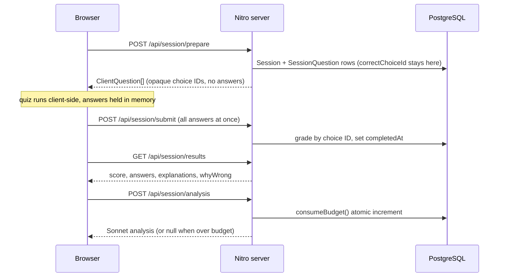

# Architecture

The technical brief: a guided tour of the five decisions that carry most of this codebase, each section stating the choice, the reasoning, and the trade-off accepted, with file paths throughout so nothing asks to be taken on faith. The five: correct answers live only on the server during a quiz; AI question generation is offline while the one live AI call is atomically budgeted; localStorage is a resilience cache, never a source of truth; admin trust is a derived stateless token and question quality is a majority vote; and the schema ships by `db push` on boot instead of migrations. [SPEC.md](SPEC.md) is the full technical spec and the source of truth; this file is the shorter read.

## Correct answers live only on the server during a quiz

Every question is assembled server-side in [server/utils/assembleQuestion.ts](server/utils/assembleQuestion.ts): the correct answer and three AI-generated distractors become four choices with freshly minted opaque UUIDs, shuffled by [server/utils/shuffle.ts](server/utils/shuffle.ts). Before the response leaves [server/api/session/prepare.post.ts](server/api/session/prepare.post.ts), `toClientQuestion` projects each question down to `ClientQuestion` ([app/types/index.ts](app/types/index.ts)), stripping `isCorrect`, `correctAnswer`, and `explanation`. The winning choice ID is persisted per question in the `SessionQuestion` row ([prisma/schema.prisma](prisma/schema.prisma)); grading happens in [server/api/session/submit.post.ts](server/api/session/submit.post.ts) by comparing IDs, and answers, explanations, and per-distractor `whyWrong` notes are disclosed only by [server/api/session/results.get.ts](server/api/session/results.get.ts) after submit. Client-side cheating is prevented by construction: there is nothing to find in the payload, the DOM, or localStorage, regardless of network interception. SPEC covers the rejected alternative, client-side assembly, in [§11.1](SPEC.md#11-alternatives-considered).

The trade-off is paid on the results page. Because the quiz payload carried no answer material, [server/api/session/results.get.ts](server/api/session/results.get.ts) must reconstruct what the student saw: it re-derives each prompt from the word data, refetches distractor metadata by `(wordId, type)` pair, and matches the user's wrong choice text back to its `whyWrong` note. That is one extra round trip and some duplicated prompt logic, accepted so that the quiz payload could stay clean.

## Generation is offline; the one live call is budgeted atomically

The live app never generates questions. The pool is 496 pre-generated rows, one per `(wordId, type)` pair (enforced by a unique constraint in [prisma/schema.prisma](prisma/schema.prisma)), committed at [prisma/seed-data/questions-n3.json](prisma/seed-data/questions-n3.json) and upserted idempotently by [prisma/seed.ts](prisma/seed.ts) on every deploy. The generator script itself is deliberately kept out of the repo; its prompt rules, per-type dispatch, and distractor validation (circular, shared-kanji, and duplicate rejection) are documented in [SPEC.md §6.1](SPEC.md#61-seed-question-generation-offline-committed). Generating per session was rejected because it would put an anonymous, unauthenticated endpoint in front of paid API calls ([SPEC.md §11.3](SPEC.md#11-alternatives-considered)).

That leaves exactly one live Anthropic call, the post-session analysis in [server/api/session/analysis.post.ts](server/api/session/analysis.post.ts), and it is guarded twice. The hard ceiling is `consumeBudget()` in [server/utils/rateLimit.ts](server/utils/rateLimit.ts): a single Postgres upsert-plus-increment that reserves a slot atomically, closing the check-then-increment race the first implementation had (finding C2 in [SECURITY.md](SECURITY.md)). Underneath it, a per-IP fixed-window throttle in [server/utils/throttle.ts](server/utils/throttle.ts) (10/hour) stops any single client draining the shared daily budget. Results are cached on `Session.analysis`, so revisiting a results page costs nothing.

The trade-off is a fixed pool and a hard stop. Repeat players will eventually see repeated questions, and once `DAILY_API_LIMIT` is spent the flagship AI feature disappears for everyone until midnight UTC; the endpoint degrades to `{ analysis: null }` and the UI omits the panel rather than erroring. Both are the right shape for a public demo where the realistic threat is denial of wallet, not scale.

## localStorage is a cache, never a source of truth

Two localStorage keys exist and both are disposable. `kalima_session_v1` ([app/composables/useSession.ts](app/composables/useSession.ts)) mirrors the active session so a mid-quiz refresh restores from cache ([app/pages/quiz.vue](app/pages/quiz.vue) falls back to it when the Pinia store is empty); the database remains authoritative, and the mirror holds only the answer-free `ClientQuestion` shape. `kalima_review_v1` ([app/stores/reviewQueue.ts](app/stores/reviewQueue.ts)) is the wrong-answer queue: upserted after every results page, pruned when a review session answers a word correctly, and replayed through the existing [server/api/session/prepare.post.ts](server/api/session/prepare.post.ts) endpoint, which whitelist-validates every `type` and dedupes the pairs before querying. The queue needed no new server endpoint, no accounts, and no schema change.

Discipline around SSR makes this safe: every localStorage access sits behind `import.meta.client`, the review store is loaded only from `onMounted` via [app/composables/useReviewQueue.ts](app/composables/useReviewQueue.ts), and both stores are Pinia options stores rather than setup stores so SSR serialization never traverses Vue ref internals ([SPEC.md §7](SPEC.md#7-client-cache) records the invariants).

The trade-off is that progress is device-local: the review queue does not roam to another browser and dies with cleared site data. For an account-less demo that is the honest deal, and it is exactly the feature slated to move server-side when V1+ adds auth.

## Admin trust is a derived token; question quality is a vote

The `/admin` area (audit and rate all 496 seed questions) is protected by a single shared `ADMIN_PASSWORD`, but the password itself never travels in a cookie. [server/utils/adminAuth.ts](server/utils/adminAuth.ts) derives a deterministic HMAC token from it, so verification is stateless (no session store), a leaked cookie cannot reveal the secret, and rotating the password invalidates every outstanding session at once. All secret comparisons go through `safeEqual()` (constant-time), the model is fail-closed (unset password means all access denied), login is brute-force throttled, and [server/middleware/admin-auth.ts](server/middleware/admin-auth.ts) guards every `/api/admin/*` route server-side; the client-side guard in [app/middleware/admin.global.ts](app/middleware/admin.global.ts) is a UX layer, not the boundary. [SECURITY.md](SECURITY.md) records the review that forced this design: the original cookie held the raw password.

Quality control is structural rather than ad hoc. Each question carries S-F reviews, and [server/utils/rank.ts](server/utils/rank.ts) computes the effective rank by majority vote with ties breaking toward the worst rank; S, A, B, and unranked questions are protected from deletion, so bulk cleanup can never silently discard unreviewed or known-good content. Today there is one admin identity and each vote resolves to a single review; the vote logic is in place for when multiple reviewer identities exist.

The trade-off is accepted openly in [SECURITY.md](SECURITY.md): one shared credential means no per-user attribution, rotation policy, or MFA, and the per-IP throttle state is in-process memory. Both are fine for a single-maintainer demo on one instance and are on the list to replace before V1 ships real accounts.

## The schema ships by `db push` on boot, not migrations

There is no `prisma/migrations` directory. The production start command in [package.json](package.json) is `prisma db push --accept-data-loss`, then `prisma db seed`, then the Node server; [railway.json](railway.json) pins the Railpack builder and a single replica in `asia-southeast1`, with `RAILPACK_NODE_VERSION=24` set on the service. Word data is not in the database at all: [words/n3.json](words/n3.json) and its siblings are read via `fs` at request time by [server/api/session/prepare.post.ts](server/api/session/prepare.post.ts), [results.get.ts](server/api/session/results.get.ts), and [analysis.post.ts](server/api/session/analysis.post.ts), so the dictionary ships with the code, not the data layer.

The reasoning: at this stage every table is either reproducible from the repo (the seed pool, upserted idempotently on each boot) or disposable (anonymous sessions, daily rate-limit rows), so migration ceremony would version data that nothing needs preserved, and `db push` keeps schema iteration at editing one file. The single-replica pin is not incidental either; the in-memory throttle windows in [server/utils/throttle.ts](server/utils/throttle.ts) are correct only because one process handles all traffic, and the file states so.

Its known limit: `--accept-data-loss` will happily drop a renamed column, at-boot re-seeding adds startup time that grows with the pool, and the moment real user data exists (V1 accounts) this pipeline must be replaced by proper migrations, with the throttle state moved to a shared store if the app ever scales past one instance. Those are documented cliffs, deliberately not paid for before the data that justifies them exists.
